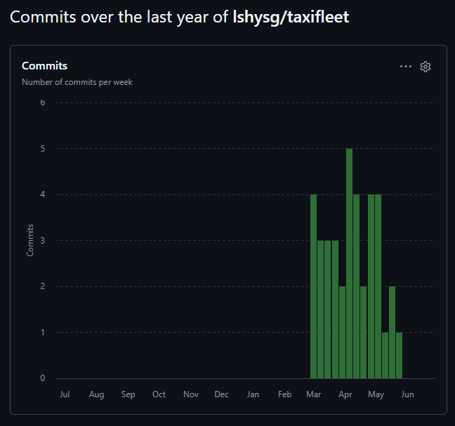
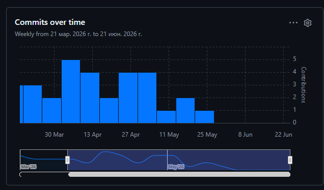

# TaxiFleet Admin

> Курсовой проект по программной инженерии  
> **Траектория В** — Мобильная разработка

## Описание

**TaxiFleet Admin** — мобильное приложение для администратора таксопарка, предназначенное для оперативного управления водителями, заказами и автомобилями. Приложение предоставляет единый интерфейс для мониторинга состояния парка, создания и распределения заказов, а также контроля статусов водителей и транспортных средств.

### Основные возможности

- Авторизация администратора по логину/паролю (JWT)
- Управление водителями (CRUD, статусы FREE / BUSY / UNAVAILABLE)
- Управление автомобилями (CRUD, статусы AVAILABLE / ON_TRIP / MAINTENANCE / BROKEN)
- Создание и отслеживание заказов (NEW → ASSIGNED → ON_WAY → DONE / CANCELLED)
- Назначение водителя на заказ с автоматическим контролем статусов
- Дашборд со сводной статистикой

## Технологии

| Компонент | Технология |
|-----------|-----------|
| Мобильное приложение | Flutter 3.x (Dart) |
| Серверная часть | Java 17, Spring Boot 3.2 |
| База данных | PostgreSQL 16 |
| Аутентификация | JWT (JSON Web Token) |
| Документация API | OpenAPI 3.0 / Swagger UI |
| Тестирование | JUnit 5, Mockito |
| Сборка | Maven, Flutter CLI |

## Структура репозитория

```
taxifleet/
├── README.md                        # Этот файл
├── .gitignore
├── taxifleet_backend/               # Серверная часть (Spring Boot)
│   ├── src/
│   │   ├── main/
│   │   │   ├── java/com/taxifleet/
│   │   │   │   ├── controller/      # REST-контроллеры
│   │   │   │   ├── service/         # Бизнес-логика
│   │   │   │   ├── repository/      # JPA-репозитории
│   │   │   │   ├── model/           # Entity-классы
│   │   │   │   ├── dto/             # DTO-классы
│   │   │   │   ├── security/        # JWT-фильтры
│   │   │   │   └── config/          # Конфигурация
│   │   │   └── resources/
│   │   │       └── application.yml
│   │   └── test/                    # JUnit-тесты
│   └── pom.xml
├── taxifleet_app/                   # Мобильное приложение (Flutter)
│   └── lib/
│       ├── models/                  # Модели данных
│       ├── providers/               # Управление состоянием
│       ├── screens/                 # Экраны UI
│       ├── services/                # API-сервисы
│       └── main.dart
└── docs/                            # Документация
    ├── images/                      # Общие изображения
    ├── 01-business-model/           # Бизнес-моделирование
    ├── 02-requirements/             # Требования
    ├── 03-architecture/             # Архитектура
    ├── 04-database/                 # База данных
    ├── 05-design/                   # Проектирование
    ├── 06-implementation/           # Реализация
    ├── 07-ui/                       # Пользовательский интерфейс
    └── 08-final/                    # Итоговые документы
```

## Быстрый старт

### Предварительные требования

- Java 17+
- Maven 3.9+
- PostgreSQL 16
- Flutter SDK 3.x
- Dart SDK (поставляется с Flutter)

### 1. Настройка базы данных

```bash
# Создать базу данных
psql -U postgres -c "CREATE DATABASE taxifleet;"

# Применить схему
psql -U postgres -d taxifleet -f docs/04-database/schema.sql

# Загрузить начальные данные
psql -U postgres -d taxifleet -f docs/04-database/data.sql
```

### 2. Запуск сервера

```bash
cd taxifleet_backend

# Настроить подключение к БД в application.yml
# spring.datasource.url=jdbc:postgresql://localhost:5432/taxifleet
# spring.datasource.username=postgres
# spring.datasource.password=your_password

mvn spring-boot:run
```

Сервер будет доступен по адресу: `http://localhost:8080`  
Swagger UI: `http://localhost:8080/swagger-ui.html`

### 3. Запуск мобильного приложения

```bash
cd taxifleet_app

# Установить зависимости
flutter pub get

# Запустить на эмуляторе или устройстве
flutter run
```

### 4. Учётные данные по умолчанию

| Логин | Пароль |
|-------|--------|
| admin | admin123 |

## Статистика разработки

### Метрики Git

- **Всего коммитов:** 40
- **Период:** 01.03.2026 — 28.05.2026
- **Средняя частота:** ~3 коммита/неделю
- **Авторов:** 1

### График активности



### Тепловая карта



## Документация

| Раздел | Описание |
|--------|----------|
| [01. Бизнес-моделирование](docs/01-business-model/README.md) | Паспорт проекта, IDEF0, BUC, SWOT |
| [02. Требования](docs/02-requirements/README.md) | Use Case, Domain Model, спецификации |
| [03. Архитектура](docs/03-architecture/README.md) | PCMEF, ADR, диаграммы пакетов |
| [04. База данных](docs/04-database/README.md) | ER-диаграмма, DDL, нормализация |
| [05. Проектирование](docs/05-design/README.md) | Sequence, Design Class, REST API |
| [06. Реализация](docs/06-implementation/README.md) | Листинги кода, тесты, рефакторинг |
| [07. Пользовательский интерфейс](docs/07-ui/README.md) | Экраны Flutter, навигация, JWT |
| [08. Итоговые документы](docs/08-final/README.md) | WBS, Ганта, руководства |

## Пояснительная записка

[Пояснительная записка (PDF)](docs/08-final/README.md)

## Лицензия

Курсовой проект. Все права защищены.
