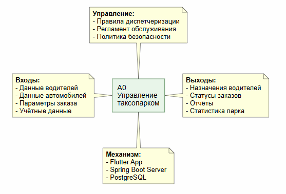
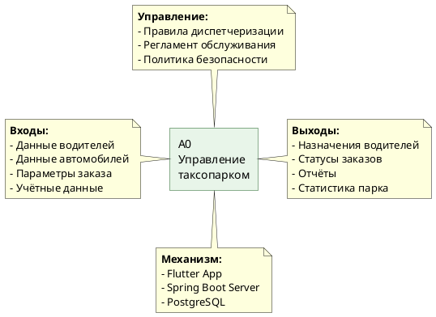
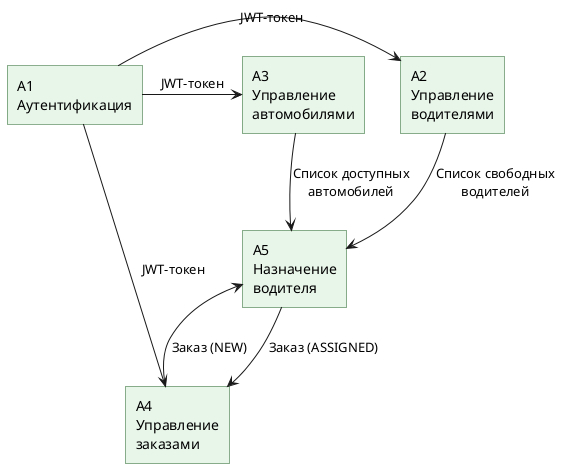
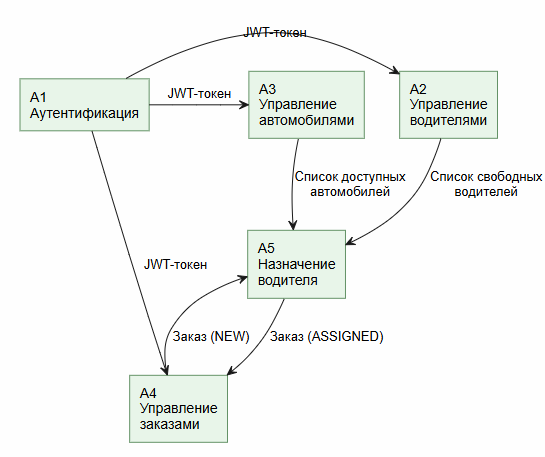
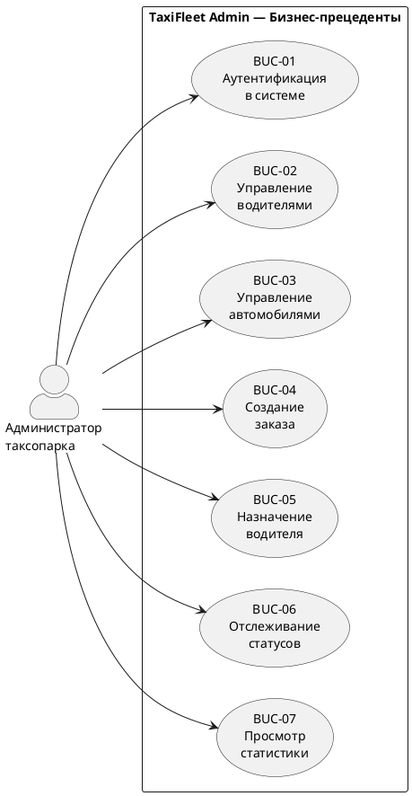
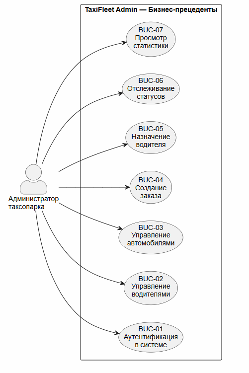
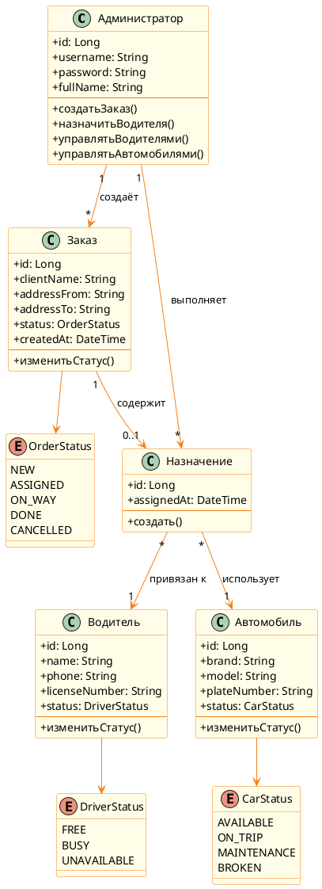
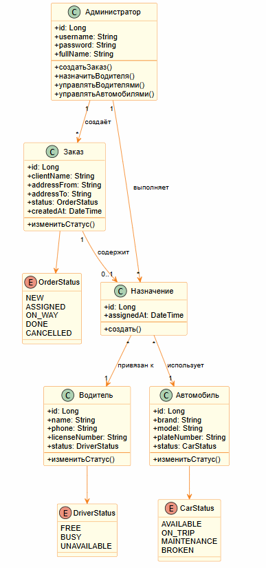

# 01. Бизнес-моделирование

> Анализ предметной области и построение бизнес-модели информационной системы таксопарка TaxiFleet Admin.

---

## 1.1 Паспорт проекта

| Параметр | Значение |
|----------|----------|
| **Название** | TaxiFleet Admin |
| **Тип** | Мобильное приложение для управления таксопарком |
| **Заказчик** | Администрация таксопарка |
| **Цель** | Автоматизация процессов управления водителями, автомобилями и заказами таксопарка |
| **Траектория** | В — Мобильная разработка |
| **Стек** | Flutter + Spring Boot + PostgreSQL + JWT |

### KPI проекта

| KPI | Целевое значение | Метрика |
|-----|-------------------|---------|
| Время создания заказа | < 30 секунд | Среднее время от открытия формы до сохранения |
| Время назначения водителя | < 15 секунд | Среднее время от выбора до подтверждения |
| Доступность системы | 99% | Uptime сервера в рабочие часы |
| Покрытие тестами | > 80% | Процент покрытия бизнес-логики |
| Время отклика API | < 500 мс | 95-й перцентиль времени ответа |

### Риски проекта

| Риск | Вероятность | Влияние | Митигация |
|------|-------------|---------|-----------|
| Несовместимость Flutter с целевыми устройствами | Средняя | Высокое | Тестирование на нескольких эмуляторах |
| Потеря JWT-токена | Низкая | Среднее | Хранение в SharedPreferences, автообновление |
| Перегрузка БД при большом числе заказов | Низкая | Высокое | Индексация, пагинация запросов |
| Некорректная синхронизация статусов | Средняя | Высокое | @Transactional, оптимистичная блокировка |

---

## 1.2 Диаграмма IDEF0 (уровень A-0)

### Контекстная диаграмма

| Элемент | Описание |
|---------|----------|
| **Функция** | A0 — Управление таксопарком |
| **Входы** | Данные водителей, данные автомобилей, параметры заказа, учётные данные администратора |
| **Выходы** | Отчёты о состоянии парка, назначения водителей, статусы заказов, статистика |
| **Управление** | Правила диспетчеризации, регламент обслуживания автомобилей, политика безопасности |
| **Механизм** | Мобильное приложение (Flutter), сервер (Spring Boot), СУБД (PostgreSQL) |

*Рисунок 1.1 — Контекстная диаграмма бизнес-процессов IDEF0 A-0*

### Декомпозиция A0

| Блок | Название | Описание |
|------|----------|----------|
| **A1** | Аутентификация | Проверка учётных данных администратора, выдача JWT-токена |
| **A2** | Управление водителями | CRUD-операции над записями водителей, управление статусами |
| **A3** | Управление автомобилями | CRUD-операции над записями автомобилей, отслеживание состояния |
| **A4** | Управление заказами | Создание, редактирование, отмена заказов |
| **A5** | Назначение водителя | Привязка свободного водителя к заказу, обновление статусов |

### PlantUML — Декомпозиция A0

*Рисунок 1.2 — Декомпозиция функциональной модели A0*

---

## 1.3 BUC-диаграмма (Бизнес-прецеденты)

### Перечень бизнес-прецедентов

| ID | Бизнес-прецедент | Актор | Описание |
|----|-------------------|-------|----------|
| BUC-01 | Аутентификация в системе | Администратор | Вход в систему по логину и паролю |
| BUC-02 | Управление водителями | Администратор | Добавление, редактирование, удаление водителей |
| BUC-03 | Управление автомобилями | Администратор | Добавление, редактирование, удаление автомобилей |
| BUC-04 | Создание заказа | Администратор | Оформление нового заказа на перевозку |
| BUC-05 | Назначение водителя | Администратор | Привязка водителя к заказу |
| BUC-06 | Отслеживание статусов | Администратор | Мониторинг текущего состояния заказов и водителей |
| BUC-07 | Просмотр статистики | Администратор | Анализ показателей работы парка |

### PlantUML — BUC-диаграмма

*Рисунок 1.3 — Диаграмма бизнес-прецедентов (BUC)*

---

## 1.4 Матрица стейкхолдеров

| Стейкхолдер | Роль | Интерес | Влияние | Стратегия |
|-------------|------|---------|---------|-----------|
| Администратор таксопарка | Основной пользователь | Высокий | Высокое | Тесное взаимодействие, сбор требований |
| Водители | Косвенный пользователь | Средний | Низкое | Информирование о статусах |
| Руководство компании | Заказчик | Высокий | Высокое | Регулярная отчётность |
| Разработчик | Исполнитель | Высокий | Высокое | Управление проектом |
| Клиенты таксопарка | Конечный потребитель | Средний | Низкое | Обеспечение качества сервиса |
| Техническая поддержка | Сопровождение | Средний | Среднее | Документация, обучение |

---

## 1.5 SWOT-анализ

| | **Положительные** | **Отрицательные** |
|---|---|---|
| **Внутренние** | **Сильные стороны (S):** | **Слабые стороны (W):** |
| | — Кроссплатформенность Flutter (iOS + Android) | — Один разработчик |
| | — Стандартизированный REST API | — Ограниченный бюджет |
| | — JWT обеспечивает безопасность | — Нет реального пользовательского тестирования |
| | — PostgreSQL — надёжная СУБД | — Ограниченный функционал первой версии |
| **Внешние** | **Возможности (O):** | **Угрозы (T):** |
| | — Расширение до мультиплатформы (Web) | — Конкуренция с готовыми CRM |
| | — Интеграция с картографическими API | — Изменение требований заказчика |
| | — Добавление push-уведомлений | — Уязвимости безопасности |
| | — Модуль аналитики и отчётов | — Изменения в законодательстве о персональных данных |

---

## 1.6 Бизнес-глоссарий

| Термин | Определение |
|--------|------------|
| Таксопарк | Организация, владеющая парком автомобилей для оказания услуг такси |
| Администратор | Сотрудник таксопарка, управляющий водителями, заказами и автомобилями |
| Водитель | Работник таксопарка, выполняющий перевозки |
| Заказ | Запрос на перевозку пассажира из точки А в точку Б |
| Назначение | Привязка конкретного водителя к конкретному заказу |
| Автомобиль | Транспортное средство, закреплённое за таксопарком |
| Статус водителя | Текущее состояние водителя: FREE (свободен), BUSY (занят), UNAVAILABLE (недоступен) |
| Статус автомобиля | Текущее состояние автомобиля: AVAILABLE, ON_TRIP, MAINTENANCE, BROKEN |
| Статус заказа | Текущее состояние заказа: NEW, ASSIGNED, ON_WAY, DONE, CANCELLED |
| JWT | JSON Web Token — токен аутентификации для доступа к API |
| REST API | Интерфейс взаимодействия клиента и сервера по протоколу HTTP |
| Диспетчеризация | Процесс распределения заказов между водителями |
| CRUD | Набор операций: создание, чтение, обновление, удаление |
| Аутентификация | Процесс проверки подлинности пользователя |
| Авторизация | Процесс определения прав доступа пользователя |
| Пагинация | Разбиение больших списков на страницы для отображения |

---

## 1.7 Модель бизнес-классов

Модель описывает основные бизнес-сущности и их взаимосвязи в предметной области таксопарка.

| Класс | Атрибуты | Связи |
|-------|----------|-------|
| **Администратор** | id, username, password, fullName | Создаёт заказы, управляет водителями |
| **Водитель** | id, name, phone, licenseNumber, status | Получает назначения |
| **Автомобиль** | id, brand, model, plateNumber, status | Используется в назначениях |
| **Заказ** | id, clientName, addressFrom, addressTo, status, createdAt | Содержит назначение |
| **Назначение** | id, orderId, driverId, carId, assignedAt | Связывает заказ, водителя и автомобиль |

### PlantUML — Модель бизнес-классов

*Рисунок 1.4 — Модель бизнес-классов предметной области*

---

## Навигация

| Предыдущий | Следующий |
|------------|-----------|
| [README](../../README.md) | [02. Требования](../02-requirements/README.md) |
