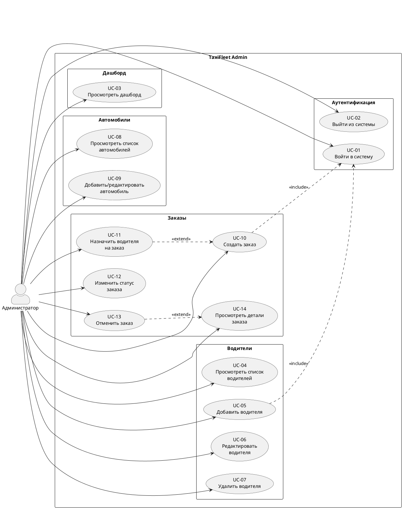
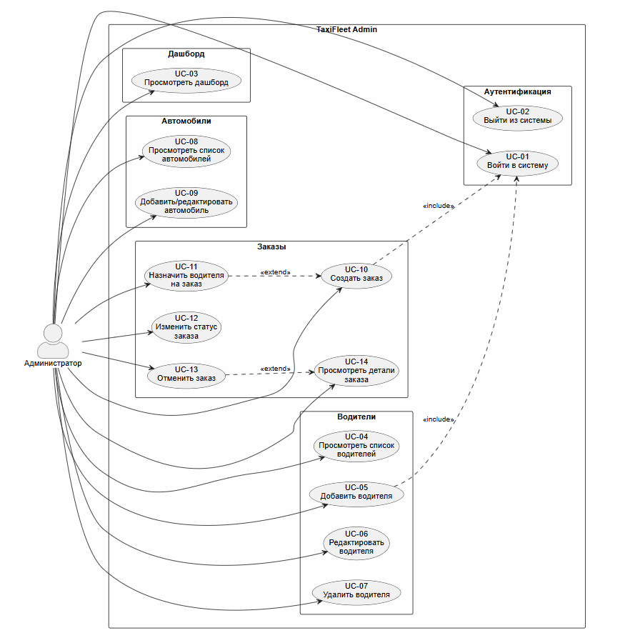
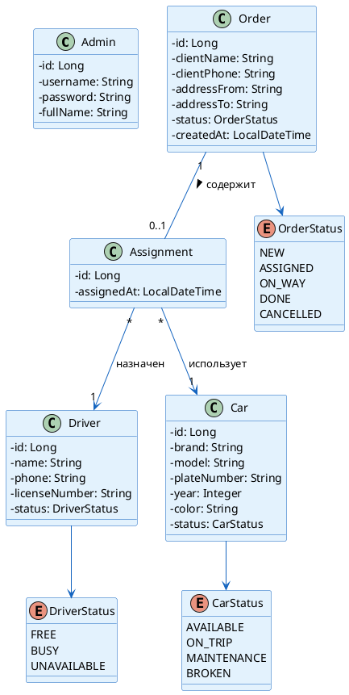
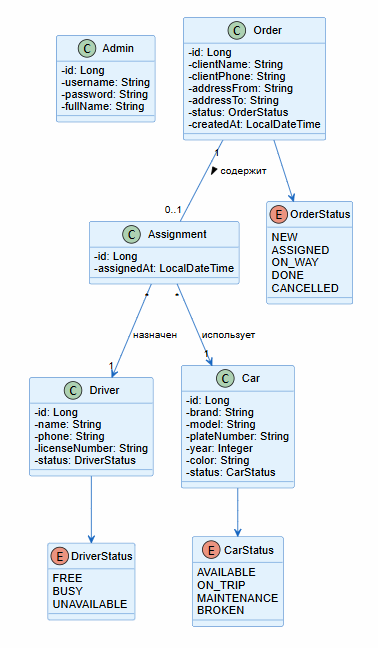

# 02. Требования

> Спецификация требований к информационной системе TaxiFleet Admin: прецеденты использования, доменная модель, глоссарий.

---

## 2.1 Use Case диаграмма

### Перечень прецедентов

| ID | Прецедент | Актор | Приоритет |
|----|-----------|-------|-----------|
| UC-01 | Войти в систему | Администратор | Высокий |
| UC-02 | Выйти из системы | Администратор | Высокий |
| UC-03 | Просмотреть дашборд | Администратор | Средний |
| UC-04 | Просмотреть список водителей | Администратор | Высокий |
| UC-05 | Добавить водителя | Администратор | Высокий |
| UC-06 | Редактировать водителя | Администратор | Средний |
| UC-07 | Удалить водителя | Администратор | Средний |
| UC-08 | Просмотреть список автомобилей | Администратор | Высокий |
| UC-09 | Добавить / редактировать автомобиль | Администратор | Средний |
| UC-10 | Создать заказ | Администратор | Высокий |
| UC-11 | Назначить водителя на заказ | Администратор | Высокий |
| UC-12 | Изменить статус заказа | Администратор | Средний |
| UC-13 | Отменить заказ | Администратор | Средний |
| UC-14 | Просмотреть детали заказа | Администратор | Средний |

### PlantUML — Use Case диаграмма

---

## 2.2 Domain Model (Доменная модель)

### Классы предметной области

| Класс | Описание | Атрибуты |
|-------|----------|----------|
| **Admin** | Администратор системы | id, username, password, fullName |
| **Driver** | Водитель таксопарка | id, name, phone, licenseNumber, status |
| **Car** | Автомобиль парка | id, brand, model, plateNumber, year, color, status |
| **Order** | Заказ на перевозку | id, clientName, clientPhone, addressFrom, addressTo, status, createdAt |
| **Assignment** | Назначение водителя на заказ | id, order, driver, car, assignedAt |

### Перечисления (Enum)

| Enum | Значения | Описание |
|------|----------|----------|
| **DriverStatus** | FREE, BUSY, UNAVAILABLE | Статус водителя |
| **CarStatus** | AVAILABLE, ON_TRIP, MAINTENANCE, BROKEN | Статус автомобиля |
| **OrderStatus** | NEW, ASSIGNED, ON_WAY, DONE, CANCELLED | Статус заказа |

### PlantUML — Domain Model

---

## 2.3 Спецификация UC-10: Создать заказ

| Поле | Значение |
|------|----------|
| **ID** | UC-10 |
| **Название** | Создать заказ |
| **Актор** | Администратор |
| **Предусловие** | Администратор аутентифицирован в системе |
| **Постусловие** | Создан новый заказ со статусом NEW |
| **Триггер** | Администратор нажимает кнопку «Новый заказ» на экране заказов |

### Основной поток

| Шаг | Действие |
|-----|----------|
| 1 | Администратор нажимает кнопку «Новый заказ» |
| 2 | Система отображает форму создания заказа |
| 3 | Администратор заполняет поля: имя клиента, телефон клиента, адрес отправления, адрес назначения |
| 4 | Администратор нажимает кнопку «Создать» |
| 5 | Система валидирует введённые данные |
| 6 | Система сохраняет заказ в БД со статусом NEW |
| 7 | Система отображает обновлённый список заказов |

### Альтернативные потоки

| ID | Условие | Действие |
|----|---------|----------|
| 5a | Не заполнены обязательные поля | Система отображает сообщение об ошибке, форма остаётся открытой |
| 5b | Некорректный формат телефона | Система отображает подсказку о корректном формате |
| 6a | Ошибка сохранения в БД | Система отображает сообщение об ошибке сервера |

---

## 2.4 Спецификация UC-11: Назначить водителя на заказ

| Поле | Значение |
|------|----------|
| **ID** | UC-11 |
| **Название** | Назначить водителя на заказ |
| **Актор** | Администратор |
| **Предусловие** | Заказ существует со статусом NEW; есть хотя бы один водитель со статусом FREE |
| **Постусловие** | Создано назначение; статус заказа → ASSIGNED; статус водителя → BUSY; статус автомобиля → ON_TRIP |
| **Триггер** | Администратор нажимает «Назначить водителя» на экране деталей заказа |

### Основной поток

| Шаг | Действие |
|-----|----------|
| 1 | Администратор открывает экран деталей заказа |
| 2 | Администратор нажимает кнопку «Назначить водителя» |
| 3 | Система отображает список свободных водителей (status = FREE) |
| 4 | Администратор выбирает водителя из списка |
| 5 | Система отображает список доступных автомобилей (status = AVAILABLE) |
| 6 | Администратор выбирает автомобиль |
| 7 | Администратор подтверждает назначение |
| 8 | Система в рамках одной транзакции (@Transactional): создаёт запись Assignment, обновляет статус заказа на ASSIGNED, обновляет статус водителя на BUSY, обновляет статус автомобиля на ON_TRIP |
| 9 | Система отображает обновлённые детали заказа |

### Альтернативные потоки

| ID | Условие | Действие |
|----|---------|----------|
| 3a | Нет свободных водителей | Система отображает сообщение «Нет доступных водителей» |
| 5a | Нет доступных автомобилей | Система отображает сообщение «Нет доступных автомобилей» |
| 8a | Ошибка транзакции | Система выполняет rollback, все статусы остаются без изменений |
| 8b | Водитель уже занят (race condition) | Система отображает ошибку «Водитель уже назначен на другой заказ» |

---

## 2.5 Расширенный глоссарий

| Термин | Определение | Контекст |
|--------|------------|----------|
| Admin (Администратор) | Пользователь системы с полными правами управления | Единственная роль в системе |
| Driver (Водитель) | Работник, выполняющий перевозки | Управляется администратором |
| Car (Автомобиль) | Транспортное средство в парке | Привязывается к назначению |
| Order (Заказ) | Запрос на перевозку | Основная бизнес-единица |
| Assignment (Назначение) | Связь заказа с водителем и автомобилем | Создаётся при назначении |
| JWT (JSON Web Token) | Токен аутентификации | Используется для авторизации API-запросов |
| REST API | Стиль архитектуры веб-сервисов | Протокол взаимодействия клиент-сервер |
| CRUD | Create, Read, Update, Delete | Базовые операции над данными |
| DriverStatus | Перечисление статусов водителя | FREE, BUSY, UNAVAILABLE |
| CarStatus | Перечисление статусов автомобиля | AVAILABLE, ON_TRIP, MAINTENANCE, BROKEN |
| OrderStatus | Перечисление статусов заказа | NEW, ASSIGNED, ON_WAY, DONE, CANCELLED |
| @Transactional | Аннотация Spring для транзакций | Гарантирует атомарность операции |
| DTO | Data Transfer Object | Объект для передачи данных между слоями |
| Entity | JPA-сущность | Объект, маппированный на таблицу БД |
| Repository | JPA-репозиторий | Интерфейс доступа к данным |
| Service | Сервисный класс | Содержит бизнес-логику |
| Controller | REST-контроллер | Обрабатывает HTTP-запросы |
| Endpoint | Конечная точка API | URL + HTTP-метод для конкретной операции |
| Пагинация | Постраничная навигация | Разбиение списков на страницы |
| Валидация | Проверка корректности данных | Выполняется на клиенте и сервере |

---

## 2.6 Таблица трассировки (BUC → UC)

| BUC | UC |
|-----|----|
| BUC-01 Аутентификация | UC-01, UC-02 |
| BUC-02 Управление водителями | UC-04, UC-05, UC-06, UC-07 |
| BUC-03 Управление автомобилями | UC-08, UC-09 |
| BUC-04 Создание заказа | UC-10 |
| BUC-05 Назначение водителя | UC-11 |
| BUC-06 Отслеживание статусов | UC-12, UC-13, UC-14 |
| BUC-07 Просмотр статистики | UC-03 |

---

## Навигация

| Предыдущий | Следующий |
|------------|-----------|
| [01. Бизнес-моделирование](../01-business-model/README.md) | [03. Архитектура](../03-architecture/README.md) |
