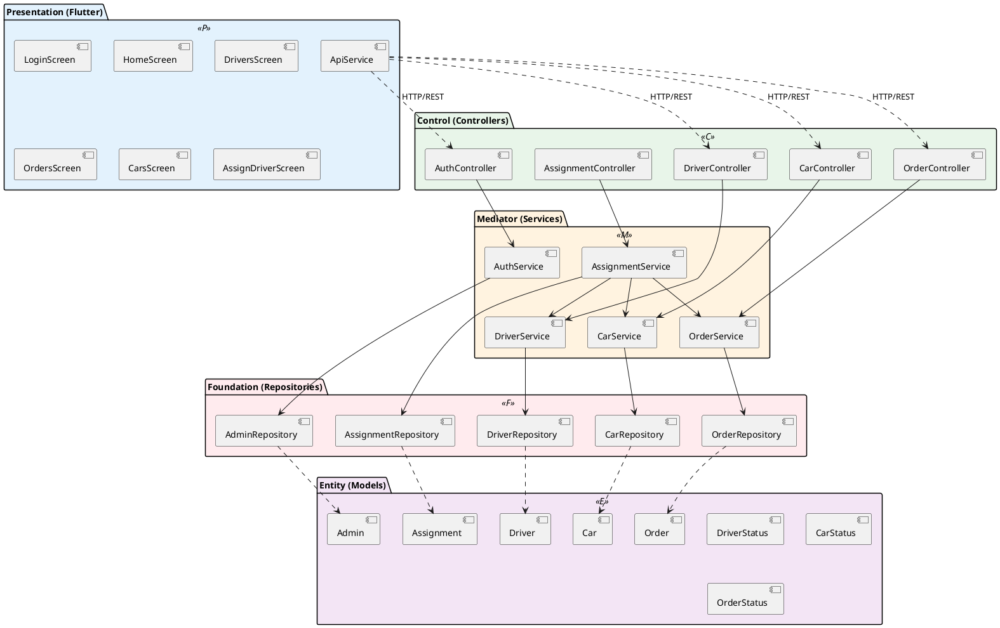
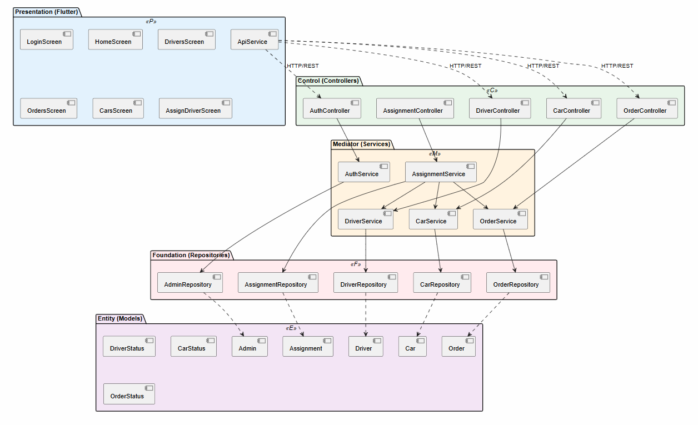
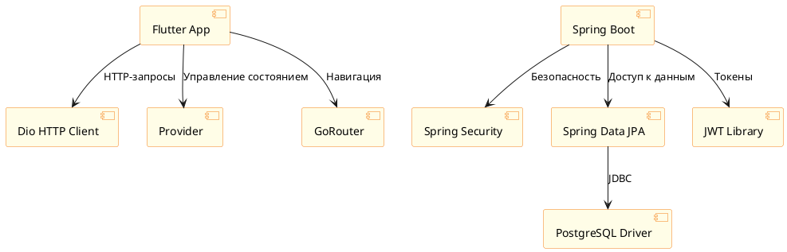
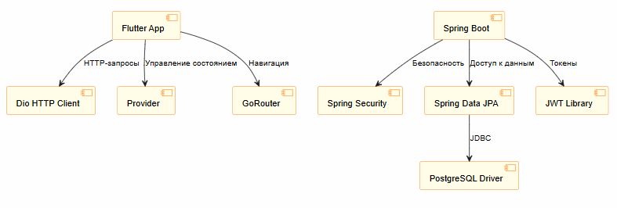

# 03. Архитектура

> Архитектурные решения информационной системы TaxiFleet Admin: модель PCMEF, межслойные интерфейсы, ADR.

---

## 3.1 Выбор архитектурного стиля — PCMEF

Для проекта выбрана архитектурная модель **PCMEF** (Presentation — Control — Mediator — Entity — Foundation), адаптированная для Spring Boot + Flutter.

### Обоснование выбора

| Критерий | PCMEF | MVC | Микросервисы |
|----------|-------|-----|-------------|
| Разделение ответственности | Чёткое (5 слоёв) | Среднее (3 слоя) | Высокое |
| Сложность реализации | Средняя | Низкая | Высокая |
| Масштабируемость | Хорошая | Средняя | Отличная |
| Подходит для учебного проекта | Да | Да | Нет |
| Тестируемость | Высокая | Средняя | Высокая |

PCMEF выбран как оптимальный баланс между строгостью архитектуры и реализуемостью в рамках курсового проекта.

---

## 3.2 Описание слоёв PCMEF

| Слой | Буква | Технология | Ключевые классы | Ответственность | НЕ должен |
|------|-------|------------|-----------------|-----------------|-----------|
| **Presentation** | P | Flutter (Dart) | LoginScreen, HomeScreen, DriversScreen, OrdersScreen, CarsScreen, AssignDriverScreen | Отображение UI, сбор пользовательского ввода | Содержать бизнес-логику, обращаться к БД |
| **Control** | C | Spring Boot Controllers | AuthController, DriverController, OrderController, CarController, AssignmentController | Приём HTTP-запросов, маршрутизация, валидация | Содержать бизнес-логику, SQL-запросы |
| **Mediator** | M | Spring Boot Services | AuthService, DriverService, OrderService, CarService, AssignmentService | Бизнес-логика, оркестрация, транзакции | Работать с HTTP, знать о UI |
| **Entity** | E | JPA Entities + DTOs | Admin, Driver, Car, Order, Assignment, DriverDTO, OrderDTO | Хранение данных, маппинг на таблицы | Содержать бизнес-логику |
| **Foundation** | F | Spring Data JPA | AdminRepository, DriverRepository, OrderRepository, CarRepository, AssignmentRepository | Доступ к данным, CRUD-операции | Содержать бизнес-логику, знать о HTTP |

---

## 3.3 Интерфейсы между слоями

### IDriverService (Control → Mediator)

```java
public interface IDriverService {
    List<Driver> getAllDrivers();
    Driver getDriverById(Long id);
    Driver createDriver(Driver driver);
    Driver updateDriver(Long id, Driver driver);
    void deleteDriver(Long id);
    List<Driver> getFreeDrivers();
}
```

### IOrderService (Control → Mediator)

```java
public interface IOrderService {
    List<Order> getAllOrders();
    Order getOrderById(Long id);
    Order createOrder(Order order);
    Order updateOrderStatus(Long id, OrderStatus status);
    void cancelOrder(Long id);
}
```

### ICarService (Control → Mediator)

```java
public interface ICarService {
    List<Car> getAllCars();
    Car getCarById(Long id);
    Car createCar(Car car);
    Car updateCar(Long id, Car car);
    void deleteCar(Long id);
    List<Car> getAvailableCars();
}
```

### IDriverRepository (Mediator → Foundation)

```java
public interface IDriverRepository extends JpaRepository<Driver, Long> {
    List<Driver> findByStatus(DriverStatus status);
    Optional<Driver> findByLicenseNumber(String licenseNumber);
    boolean existsByPhone(String phone);
}
```

### IOrderRepository (Mediator → Foundation)

```java
public interface IOrderRepository extends JpaRepository<Order, Long> {
    List<Order> findByStatus(OrderStatus status);
    List<Order> findByClientNameContainingIgnoreCase(String name);
    List<Order> findAllByOrderByCreatedAtDesc();
}
```

---

## 3.4 ADR (Architecture Decision Records)

| ID | Решение | Альтернативы | Обоснование | Статус |
|----|---------|-------------|-------------|--------|
| ADR-01 | Flutter для мобильного приложения | React Native, Kotlin | Кроссплатформенность, единая кодовая база для iOS/Android, горячая перезагрузка, Dart типизирован | Принято |
| ADR-02 | REST + JWT для взаимодействия | GraphQL, gRPC | Простота реализации, широкая поддержка, стандартизация, stateless аутентификация | Принято |
| ADR-03 | PostgreSQL как СУБД | MySQL, MongoDB | ACID-транзакции, CHECK-ограничения, надёжность, бесплатная лицензия | Принято |
| ADR-04 | Provider для управления состоянием Flutter | BLoC, Riverpod, GetX | Рекомендован Flutter-командой, простота, достаточен для масштаба проекта | Принято |
| ADR-05 | @Transactional для атомарных операций | Ручное управление транзакциями | Декларативный подход Spring, автоматический rollback, проще в сопровождении | Принято |

---

## 3.5 Диаграмма пакетов PCMEF





*Рисунок 3.1 — Диаграмма пакетов архитектуры PCMEF*

---

## 3.6 Диаграмма зависимостей





*Рисунок 3.2 — Диаграмма зависимостей компонентов*

---

## Навигация

| Предыдущий | Следующий |
|------------|-----------|
| [02. Требования](../02-requirements/README.md) | [04. База данных](../04-database/README.md) |
