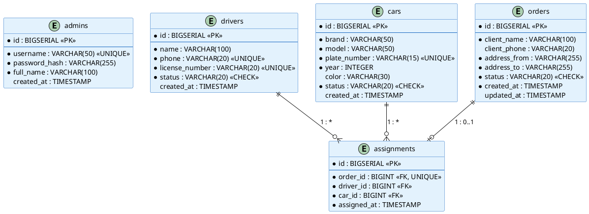
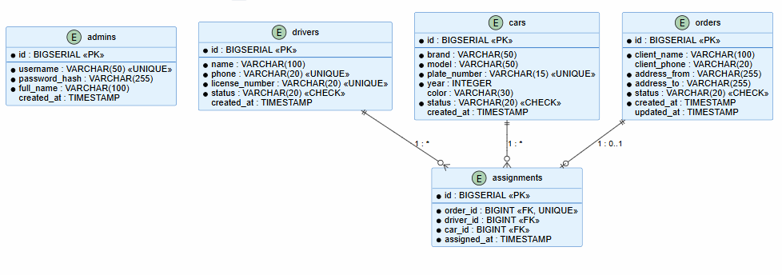

# 04. База данных

> Проектирование базы данных информационной системы TaxiFleet Admin: ER-диаграмма, DDL, нормализация, ORM-стратегия.

---

## 4.1 ER-диаграмма

База данных состоит из 5 таблиц, отражающих основные сущности предметной области таксопарка.

| Таблица | Описание | Связи |
|---------|----------|-------|
| **admins** | Администраторы системы | — |
| **drivers** | Водители таксопарка | Один ко многим с assignments |
| **cars** | Автомобили парка | Один ко многим с assignments |
| **orders** | Заказы на перевозку | Один к одному с assignments |
| **assignments** | Назначения водителей на заказы | FK → orders, drivers, cars |

### PlantUML — ER-диаграмма





*Рисунок 4.1 — ER-диаграмма базы данных*

---

## 4.2 Описание таблиц

### Таблица `admins`

| Поле | Тип | Ограничения | Описание |
|------|-----|-------------|----------|
| id | BIGSERIAL | PRIMARY KEY | Уникальный идентификатор |
| username | VARCHAR(50) | NOT NULL, UNIQUE | Логин администратора |
| password_hash | VARCHAR(255) | NOT NULL | Хеш пароля (BCrypt) |
| full_name | VARCHAR(100) | NOT NULL | ФИО администратора |
| created_at | TIMESTAMP | DEFAULT NOW() | Дата создания записи |

### Таблица `drivers`

| Поле | Тип | Ограничения | Описание |
|------|-----|-------------|----------|
| id | BIGSERIAL | PRIMARY KEY | Уникальный идентификатор |
| name | VARCHAR(100) | NOT NULL | ФИО водителя |
| phone | VARCHAR(20) | NOT NULL, UNIQUE | Номер телефона |
| license_number | VARCHAR(20) | NOT NULL, UNIQUE | Номер водительского удостоверения |
| status | VARCHAR(20) | NOT NULL, CHECK | Статус: FREE, BUSY, UNAVAILABLE |
| created_at | TIMESTAMP | DEFAULT NOW() | Дата создания записи |

### Таблица `cars`

| Поле | Тип | Ограничения | Описание |
|------|-----|-------------|----------|
| id | BIGSERIAL | PRIMARY KEY | Уникальный идентификатор |
| brand | VARCHAR(50) | NOT NULL | Марка автомобиля |
| model | VARCHAR(50) | NOT NULL | Модель автомобиля |
| plate_number | VARCHAR(15) | NOT NULL, UNIQUE | Государственный номер |
| year | INTEGER | NOT NULL, CHECK (> 1990) | Год выпуска |
| color | VARCHAR(30) | | Цвет автомобиля |
| status | VARCHAR(20) | NOT NULL, CHECK | Статус: AVAILABLE, ON_TRIP, MAINTENANCE, BROKEN |
| created_at | TIMESTAMP | DEFAULT NOW() | Дата создания записи |

### Таблица `orders`

| Поле | Тип | Ограничения | Описание |
|------|-----|-------------|----------|
| id | BIGSERIAL | PRIMARY KEY | Уникальный идентификатор |
| client_name | VARCHAR(100) | NOT NULL | Имя клиента |
| client_phone | VARCHAR(20) | | Телефон клиента |
| address_from | VARCHAR(255) | NOT NULL | Адрес отправления |
| address_to | VARCHAR(255) | NOT NULL | Адрес назначения |
| status | VARCHAR(20) | NOT NULL, CHECK | Статус: NEW, ASSIGNED, ON_WAY, DONE, CANCELLED |
| created_at | TIMESTAMP | NOT NULL, DEFAULT NOW() | Дата создания |
| updated_at | TIMESTAMP | | Дата последнего обновления |

### Таблица `assignments`

| Поле | Тип | Ограничения | Описание |
|------|-----|-------------|----------|
| id | BIGSERIAL | PRIMARY KEY | Уникальный идентификатор |
| order_id | BIGINT | NOT NULL, FK, UNIQUE | Ссылка на заказ (один к одному) |
| driver_id | BIGINT | NOT NULL, FK | Ссылка на водителя |
| car_id | BIGINT | NOT NULL, FK | Ссылка на автомобиль |
| assigned_at | TIMESTAMP | NOT NULL, DEFAULT NOW() | Дата назначения |

---

## 4.3 DDL-скрипт

Полный скрипт создания схемы БД: [schema.sql](schema.sql)

```sql
-- См. файл schema.sql для полного DDL-скрипта
-- Основные таблицы: admins, drivers, cars, orders, assignments
-- Включает CHECK-ограничения для статусов и индексы
```

---

## 4.4 ORM-стратегия

| Entity | Таблица | Основные аннотации JPA |
|--------|---------|----------------------|
| Admin | admins | @Entity, @Table, @Id, @GeneratedValue |
| Driver | drivers | @Entity, @Table, @Enumerated(STRING), @Column(unique) |
| Car | cars | @Entity, @Table, @Enumerated(STRING), @Column(unique) |
| Order | orders | @Entity, @Table(name="orders"), @Enumerated(STRING) |
| Assignment | assignments | @Entity, @ManyToOne, @OneToOne, @JoinColumn |

### Пример Entity — Driver

```java
@Entity
@Table(name = "drivers")
public class Driver {

    @Id
    @GeneratedValue(strategy = GenerationType.IDENTITY)
    private Long id;

    @Column(nullable = false, length = 100)
    private String name;

    @Column(nullable = false, unique = true, length = 20)
    private String phone;

    @Column(name = "license_number", nullable = false, unique = true, length = 20)
    private String licenseNumber;

    @Enumerated(EnumType.STRING)
    @Column(nullable = false, length = 20)
    private DriverStatus status = DriverStatus.FREE;

    @Column(name = "created_at")
    private LocalDateTime createdAt;

    @PrePersist
    protected void onCreate() {
        this.createdAt = LocalDateTime.now();
    }

    // Getters and Setters

    public Long getId() { return id; }
    public void setId(Long id) { this.id = id; }

    public String getName() { return name; }
    public void setName(String name) { this.name = name; }

    public String getPhone() { return phone; }
    public void setPhone(String phone) { this.phone = phone; }

    public String getLicenseNumber() { return licenseNumber; }
    public void setLicenseNumber(String licenseNumber) { this.licenseNumber = licenseNumber; }

    public DriverStatus getStatus() { return status; }
    public void setStatus(DriverStatus status) { this.status = status; }

    public LocalDateTime getCreatedAt() { return createdAt; }
}
```

---

## 4.5 Проверка нормализации

| Нормальная форма | Требование | Выполнено | Обоснование |
|------------------|-----------|-----------|-------------|
| **1НФ** | Все атрибуты атомарны, нет повторяющихся групп | Да | Каждое поле содержит одно значение; нет массивов или вложенных таблиц |
| **2НФ** | Нет частичных зависимостей от составного ключа | Да | Все таблицы имеют суррогатный ключ (id); все атрибуты зависят от полного ключа |
| **3НФ** | Нет транзитивных зависимостей | Да | Нет атрибутов, зависящих от неключевых полей; адреса хранятся как строки (в рамках предметной области атомарны) |

---

## Навигация

| Предыдущий | Следующий |
|------------|-----------|
| [03. Архитектура](../03-architecture/README.md) | [05. Проектирование](../05-design/README.md) |
