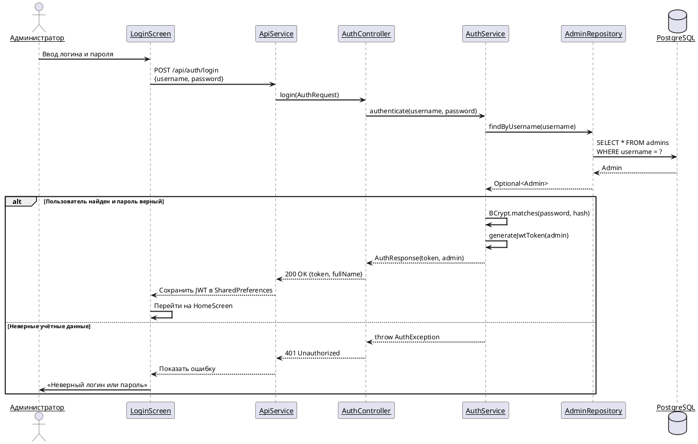
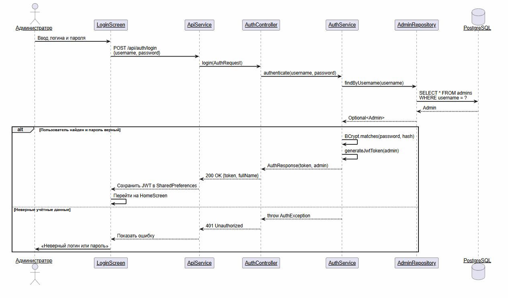
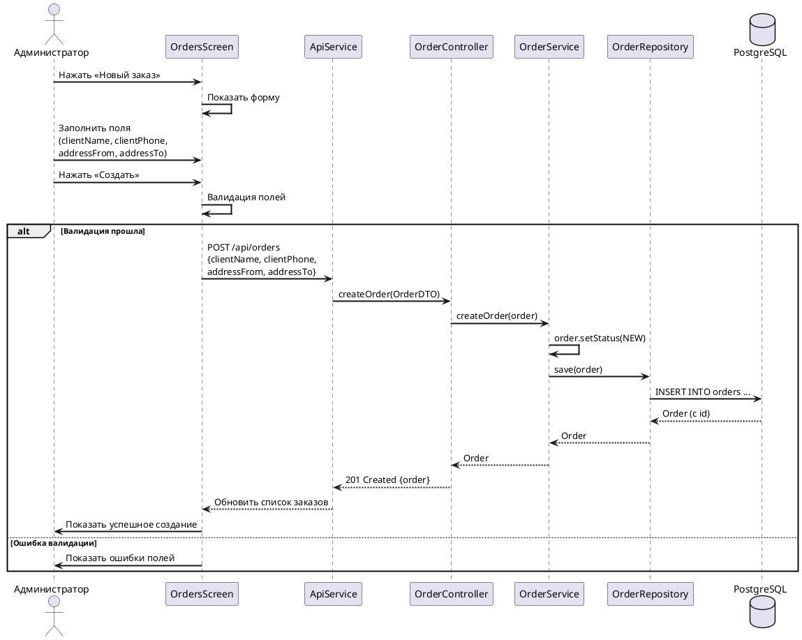
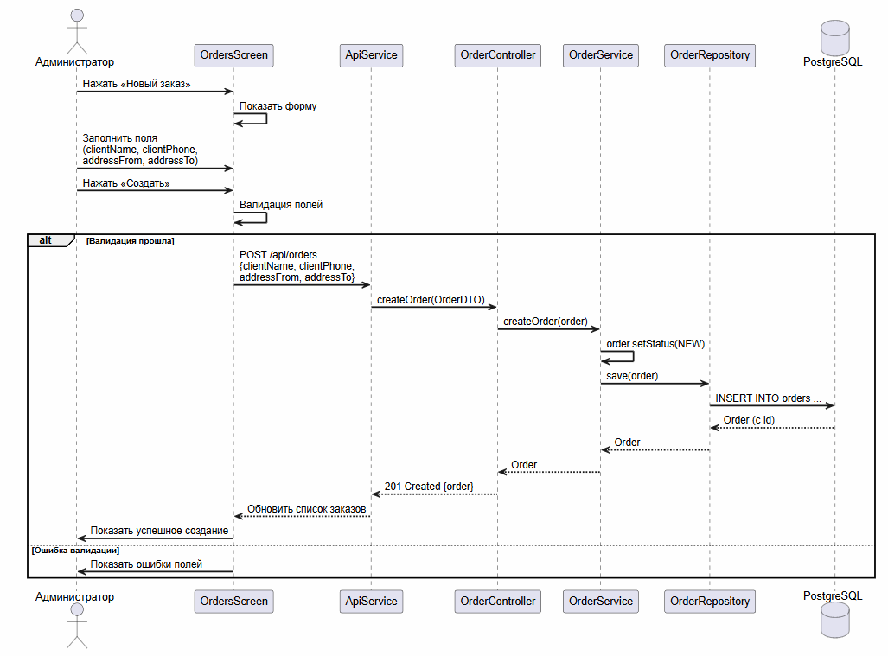
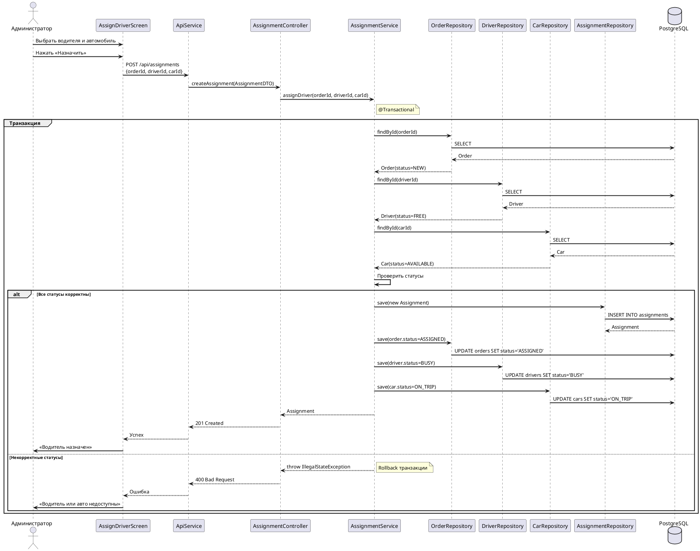
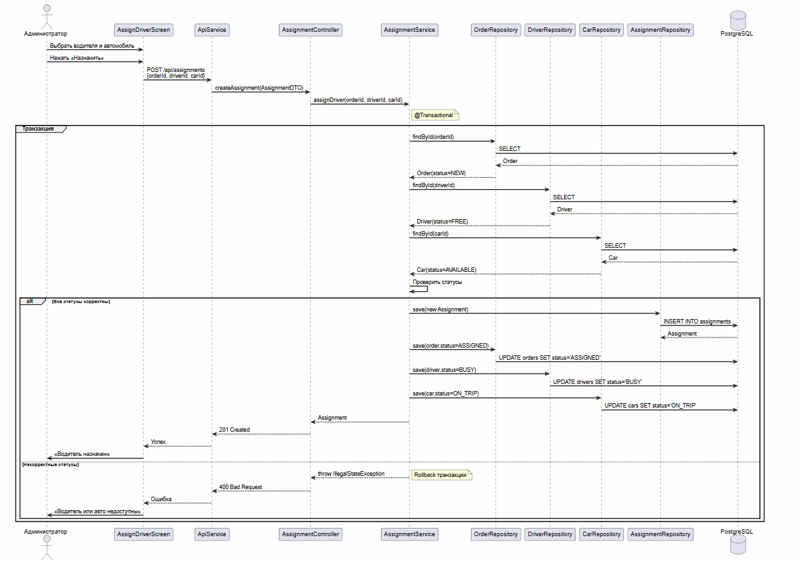
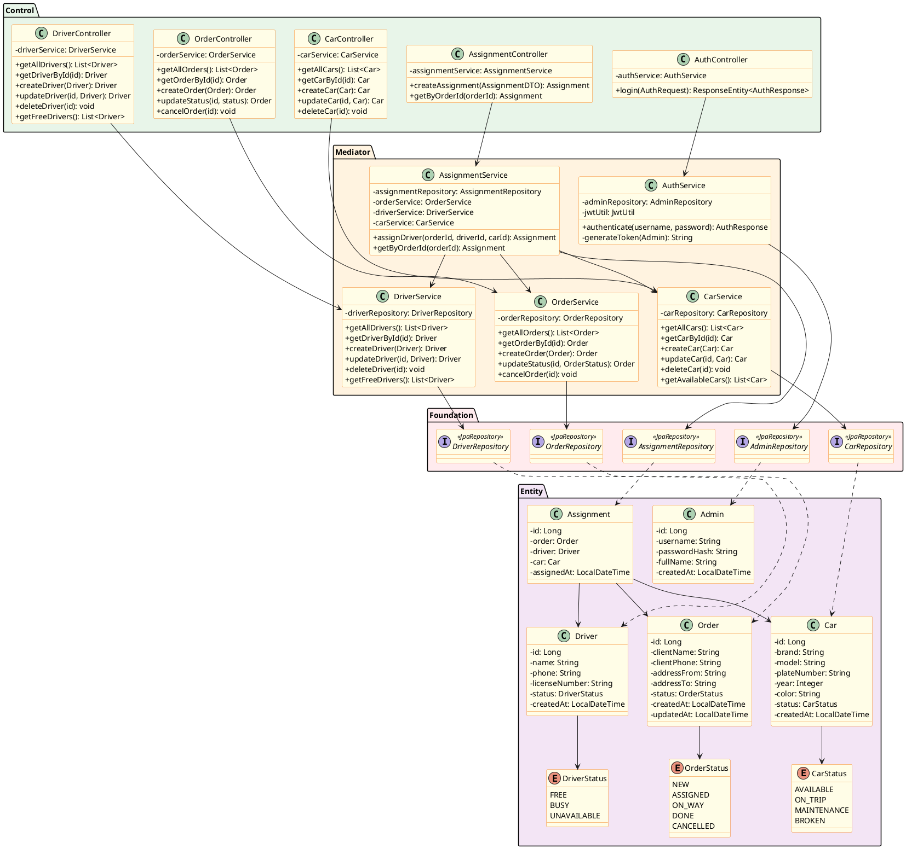
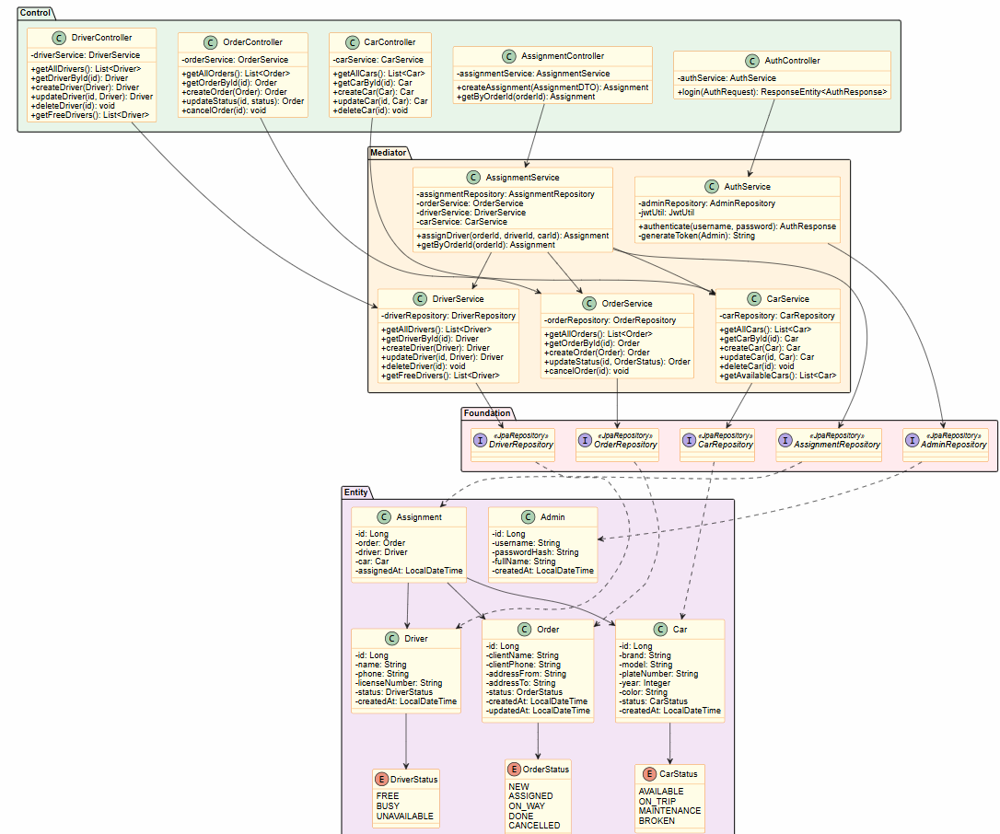

# 05. Проектирование

> Детальное проектирование информационной системы TaxiFleet Admin: диаграммы последовательности, диаграмма классов, спецификации методов, REST API.

---

## 5.1 Диаграмма последовательности — UC-01: Войти в систему





---

## 5.2 Диаграмма последовательности — UC-10: Создать заказ





---

## 5.3 Диаграмма последовательности — UC-11: Назначить водителя





---

## 5.4 Диаграмма классов проектирования





---

## 5.5 Спецификация метода `assignDriver()`

| Параметр | Значение |
|----------|----------|
| **Класс** | AssignmentService |
| **Метод** | `assignDriver(Long orderId, Long driverId, Long carId)` |
| **Возвращает** | Assignment |
| **Аннотации** | @Transactional |
| **Исключения** | EntityNotFoundException, IllegalStateException |

### Псевдокод

```
МЕТОД assignDriver(orderId, driverId, carId):
    НАЧАЛО ТРАНЗАКЦИИ

    order ← orderRepository.findById(orderId)
    ЕСЛИ order = null ТО БРОСИТЬ EntityNotFoundException("Заказ не найден")

    driver ← driverRepository.findById(driverId)
    ЕСЛИ driver = null ТО БРОСИТЬ EntityNotFoundException("Водитель не найден")

    car ← carRepository.findById(carId)
    ЕСЛИ car = null ТО БРОСИТЬ EntityNotFoundException("Автомобиль не найден")

    ЕСЛИ order.status ≠ NEW ТО
        БРОСИТЬ IllegalStateException("Заказ не в статусе NEW")

    ЕСЛИ driver.status ≠ FREE ТО
        БРОСИТЬ IllegalStateException("Водитель не свободен")

    ЕСЛИ car.status ≠ AVAILABLE ТО
        БРОСИТЬ IllegalStateException("Автомобиль недоступен")

    assignment ← новый Assignment(order, driver, car)
    assignmentRepository.save(assignment)

    order.status ← ASSIGNED
    orderRepository.save(order)

    driver.status ← BUSY
    driverRepository.save(driver)

    car.status ← ON_TRIP
    carRepository.save(car)

    КОНЕЦ ТРАНЗАКЦИИ
    ВЕРНУТЬ assignment
```

---

## 5.6 Спецификация метода `deleteDriver()`

| Параметр | Значение |
|----------|----------|
| **Класс** | DriverService |
| **Метод** | `deleteDriver(Long id)` |
| **Возвращает** | void |
| **Исключения** | EntityNotFoundException, IllegalStateException |

### Псевдокод

```
МЕТОД deleteDriver(id):
    driver ← driverRepository.findById(id)
    ЕСЛИ driver = null ТО БРОСИТЬ EntityNotFoundException("Водитель не найден")

    ЕСЛИ driver.status = BUSY ТО
        БРОСИТЬ IllegalStateException("Нельзя удалить занятого водителя")

    driverRepository.delete(driver)
```

---

## 5.7 REST API эндпоинты

| # | Метод | Эндпоинт | Описание | Тело запроса | Ответ |
|---|-------|----------|----------|-------------|-------|
| 1 | POST | `/api/auth/login` | Аутентификация | `{username, password}` | `{token, fullName}` |
| 2 | GET | `/api/drivers` | Список всех водителей | — | `[Driver]` |
| 3 | GET | `/api/drivers/{id}` | Водитель по ID | — | `Driver` |
| 4 | POST | `/api/drivers` | Создать водителя | `Driver` | `Driver` (201) |
| 5 | PUT | `/api/drivers/{id}` | Обновить водителя | `Driver` | `Driver` |
| 6 | DELETE | `/api/drivers/{id}` | Удалить водителя | — | 204 |
| 7 | GET | `/api/drivers/free` | Свободные водители | — | `[Driver]` |
| 8 | GET | `/api/orders` | Список всех заказов | — | `[Order]` |
| 9 | GET | `/api/orders/{id}` | Заказ по ID | — | `Order` |
| 10 | POST | `/api/orders` | Создать заказ | `Order` | `Order` (201) |
| 11 | PATCH | `/api/orders/{id}/status` | Изменить статус заказа | `{status}` | `Order` |
| 12 | GET | `/api/cars` | Список всех автомобилей | — | `[Car]` |
| 13 | POST | `/api/cars` | Создать автомобиль | `Car` | `Car` (201) |
| 14 | PUT | `/api/cars/{id}` | Обновить автомобиль | `Car` | `Car` |
| 15 | POST | `/api/assignments` | Назначить водителя | `{orderId, driverId, carId}` | `Assignment` (201) |

---

## Навигация

| Предыдущий | Следующий |
|------------|-----------|
| [04. База данных](../04-database/README.md) | [06. Реализация](../06-implementation/README.md) |
