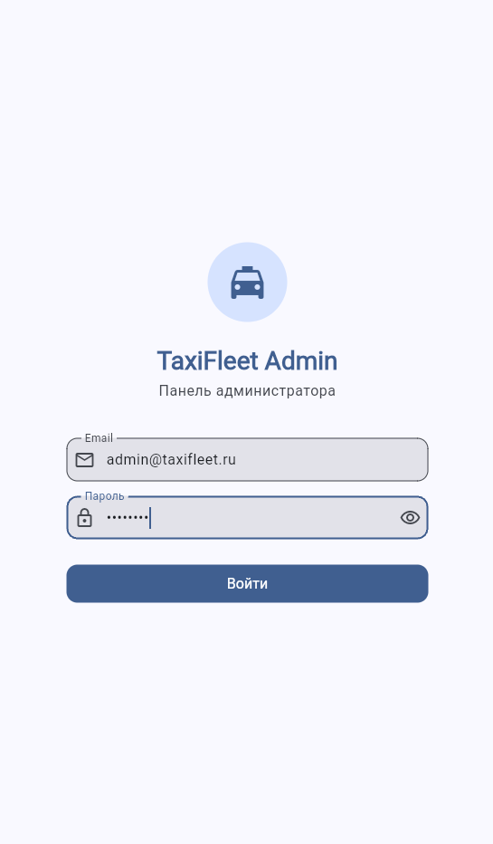
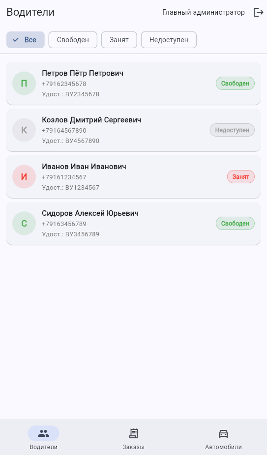
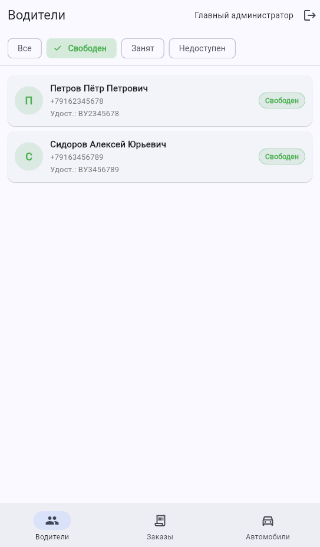
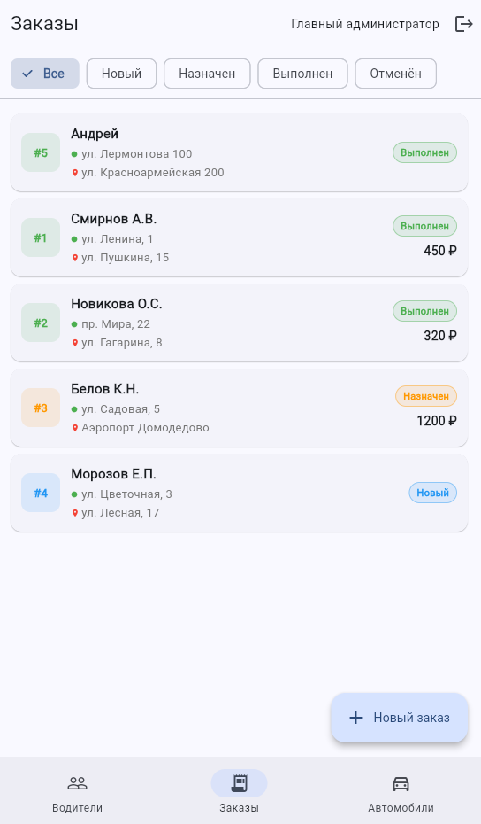
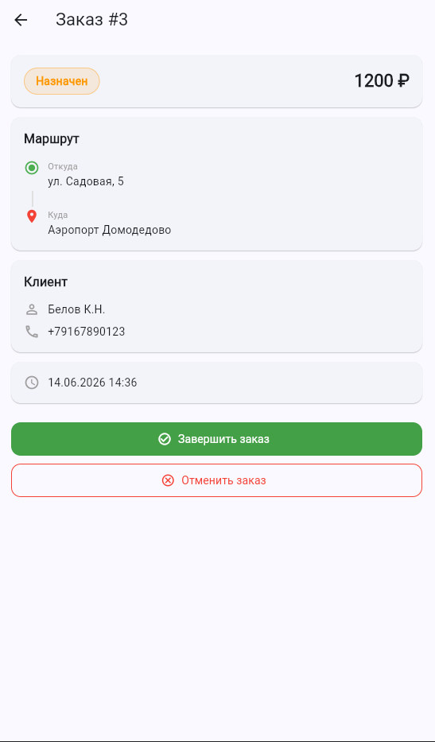
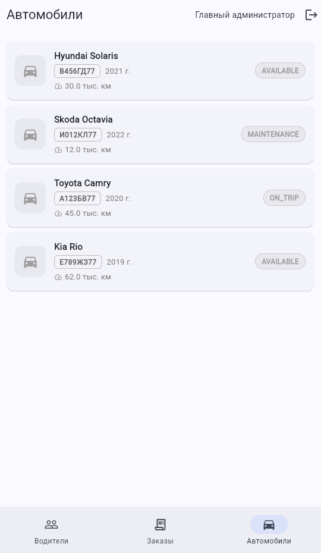
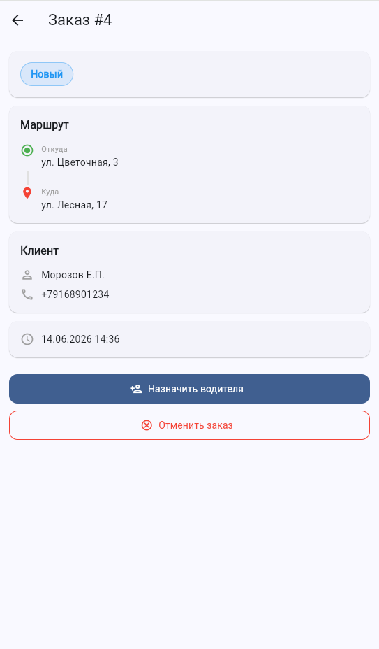

# 07. Пользовательский интерфейс

> Описание мобильного приложения TaxiFleet Admin на Flutter: экраны, навигация, управление состоянием, JWT-интеграция.

---

## 7.1 Технологии Flutter

| Пакет | Версия | Назначение |
|-------|--------|-----------|
| `dio` | ^5.4 | HTTP-клиент с поддержкой интерцепторов |
| `provider` | ^6.1 | Управление состоянием (ChangeNotifier) |
| `shared_preferences` | ^2.2 | Локальное хранение JWT-токена |
| `go_router` | ^13.0 | Декларативная навигация с redirect |
| `flutter_secure_storage` | ^9.0 | Безопасное хранение токенов |

---

## 7.2 Структура Flutter-проекта

```
taxifleet_app/lib/
├── main.dart                        # Точка входа, инициализация Provider
├── models/
│   ├── driver.dart                  # Модель Driver
│   ├── car.dart                     # Модель Car
│   ├── order.dart                   # Модель Order
│   └── assignment.dart              # Модель Assignment
├── providers/
│   ├── auth_provider.dart           # Аутентификация, JWT
│   ├── driver_provider.dart         # Состояние водителей
│   ├── order_provider.dart          # Состояние заказов
│   └── car_provider.dart            # Состояние автомобилей
├── screens/
│   ├── login_screen.dart            # Экран входа
│   ├── home_screen.dart             # Главный экран (дашборд)
│   ├── drivers_screen.dart          # Список водителей
│   ├── orders_screen.dart           # Список заказов
│   ├── order_detail_screen.dart     # Детали заказа
│   ├── cars_screen.dart             # Список автомобилей
│   └── assign_driver_screen.dart    # Назначение водителя
├── services/
│   └── api_service.dart             # Dio HTTP-клиент + JWT интерцептор
└── router/
    └── app_router.dart              # GoRouter конфигурация
```

---

## 7.3 Описание экранов

| Экран | Файл | Функциональность |
|-------|------|-----------------|
| **LoginScreen** | `login_screen.dart` | Форма входа (логин/пароль), валидация полей, отображение ошибок аутентификации, сохранение JWT |
| **HomeScreen** | `home_screen.dart` | Дашборд со сводной статистикой: количество водителей по статусам, количество заказов по статусам, количество автомобилей. Навигация к разделам |
| **DriversScreen** | `drivers_screen.dart` | Список водителей с цветовой индикацией статуса. Кнопки добавления, редактирования, удаления. Диалоги подтверждения |
| **OrdersScreen** | `orders_screen.dart` | Список заказов с фильтрацией по статусу. Кнопка создания нового заказа. Переход к деталям заказа |
| **OrderDetailScreen** | `order_detail_screen.dart` | Полная информация о заказе: клиент, адреса, статус, назначенный водитель. Кнопки изменения статуса и назначения водителя |
| **CarsScreen** | `cars_screen.dart` | Список автомобилей с отображением марки, модели, госномера и статуса. CRUD-операции |
| **AssignDriverScreen** | `assign_driver_screen.dart` | Выбор свободного водителя и доступного автомобиля для назначения на заказ. Выпадающие списки с фильтрацией по статусу |

---

## 7.4 Навигация (GoRouter)

Навигация реализована через `GoRouter` с поддержкой redirect для проверки аутентификации.

```dart
final GoRouter router = GoRouter(
  initialLocation: '/login',
  redirect: (context, state) {
    final authProvider = context.read<AuthProvider>();
    final isLoggedIn = authProvider.isAuthenticated;
    final isLoginRoute = state.matchedLocation == '/login';

    if (!isLoggedIn && !isLoginRoute) return '/login';
    if (isLoggedIn && isLoginRoute) return '/home';
    return null;
  },
  routes: [
    GoRoute(
      path: '/login',
      builder: (context, state) => const LoginScreen(),
    ),
    GoRoute(
      path: '/home',
      builder: (context, state) => const HomeScreen(),
    ),
    GoRoute(
      path: '/drivers',
      builder: (context, state) => const DriversScreen(),
    ),
    GoRoute(
      path: '/orders',
      builder: (context, state) => const OrdersScreen(),
    ),
    GoRoute(
      path: '/orders/:id',
      builder: (context, state) {
        final id = int.parse(state.pathParameters['id']!);
        return OrderDetailScreen(orderId: id);
      },
    ),
    GoRoute(
      path: '/cars',
      builder: (context, state) => const CarsScreen(),
    ),
    GoRoute(
      path: '/orders/:id/assign',
      builder: (context, state) {
        final id = int.parse(state.pathParameters['id']!);
        return AssignDriverScreen(orderId: id);
      },
    ),
  ],
);
```

### Схема навигации

```
LoginScreen ──→ HomeScreen ──→ DriversScreen
                    │          OrdersScreen ──→ OrderDetailScreen ──→ AssignDriverScreen
                    └──→ CarsScreen
```

---

## 7.5 Управление состоянием (Provider + ChangeNotifier)

Каждый раздел приложения имеет свой `ChangeNotifier` Provider:

```dart
class DriverProvider extends ChangeNotifier {
  final ApiService _apiService;
  List<Driver> _drivers = [];
  bool _isLoading = false;
  String? _error;

  List<Driver> get drivers => _drivers;
  bool get isLoading => _isLoading;
  String? get error => _error;

  List<Driver> get freeDrivers =>
      _drivers.where((d) => d.status == 'FREE').toList();

  Future<void> loadDrivers() async {
    _isLoading = true;
    _error = null;
    notifyListeners();

    try {
      _drivers = await _apiService.getDrivers();
    } catch (e) {
      _error = 'Ошибка загрузки водителей';
    }

    _isLoading = false;
    notifyListeners();
  }

  Future<void> deleteDriver(int id) async {
    await _apiService.deleteDriver(id);
    _drivers.removeWhere((d) => d.id == id);
    notifyListeners();
  }
}
```

### Инициализация в main.dart

```dart
void main() {
  runApp(
    MultiProvider(
      providers: [
        ChangeNotifierProvider(create: (_) => AuthProvider()),
        ChangeNotifierProvider(create: (_) => DriverProvider()),
        ChangeNotifierProvider(create: (_) => OrderProvider()),
        ChangeNotifierProvider(create: (_) => CarProvider()),
      ],
      child: const TaxiFleetApp(),
    ),
  );
}
```

---

## 7.6 JWT-интерцептор Dio

```dart
class ApiService {
  late final Dio _dio;
  final SharedPreferences _prefs;

  ApiService(this._prefs) {
    _dio = Dio(BaseOptions(
      baseUrl: 'http://10.0.2.2:8080/api',
      connectTimeout: const Duration(seconds: 10),
      receiveTimeout: const Duration(seconds: 10),
      headers: {'Content-Type': 'application/json'},
    ));

    _dio.interceptors.add(InterceptorsWrapper(
      onRequest: (options, handler) {
        final token = _prefs.getString('jwt_token');
        if (token != null) {
          options.headers['Authorization'] = 'Bearer $token';
        }
        handler.next(options);
      },
      onError: (error, handler) {
        if (error.response?.statusCode == 401) {
          _prefs.remove('jwt_token');
          // Navigate to login
        }
        handler.next(error);
      },
    ));
  }

  Future<List<Driver>> getDrivers() async {
    final response = await _dio.get('/drivers');
    return (response.data as List)
        .map((json) => Driver.fromJson(json))
        .toList();
  }

  // ... другие методы API
}
```

---

## Локальное кэширование (оффлайн-режим)

В приложении реализовано локальное кэширование данных о водителях
через `SharedPreferences`. Реализация находится в файле
`lib/providers/drivers_provider.dart`.

**Принцип работы:**
- При успешной загрузке список водителей сериализуется в JSON
  и сохраняется в `SharedPreferences` с ключом `cached_drivers`
- При отсутствии соединения с сервером данные автоматически
  загружаются из локального кэша
- Пользователь видит сообщение: «Нет соединения — показаны кэшированные данные»
- Поле `fromCache` позволяет UI отображать индикатор оффлайн-режима

**Используемые технологии:** `SharedPreferences`, `dart:convert` (jsonEncode/jsonDecode)

**Файлы:**
- `lib/providers/drivers_provider.dart` — логика кэширования
- `lib/models/driver.dart` — метод `toJson()` для сериализации

---

## 7.7 Скриншоты экранов

### Экран входа


*Рисунок 7.1 — Экран входа в систему (LoginScreen)*

### Главный экран (Дашборд)


*Рисунок 7.2 — Главный экран (HomeScreen)*

### Список водителей


*Рисунок 7.3 — Экран списка водителей (DriversScreen)*

### Список заказов


*Рисунок 7.4 — Экран списка заказов (OrdersScreen)*

### Детали заказа


*Рисунок 7.5 — Экран деталей заказа (OrderDetailScreen)*

### Список автомобилей


*Рисунок 7.6 — Экран списка автомобилей (CarsScreen)*

### Назначение водителя


*Рисунок 7.7 — Экран назначения водителя (AssignDriverScreen)*


## Навигация

| Предыдущий | Следующий |
|------------|-----------|
| [06. Реализация](../06-implementation/README.md) | [08. Итоговые документы](../08-final/README.md) |
