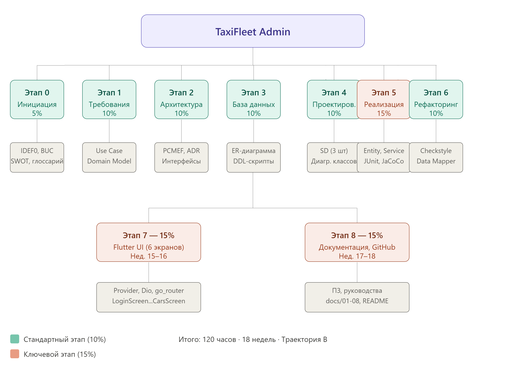
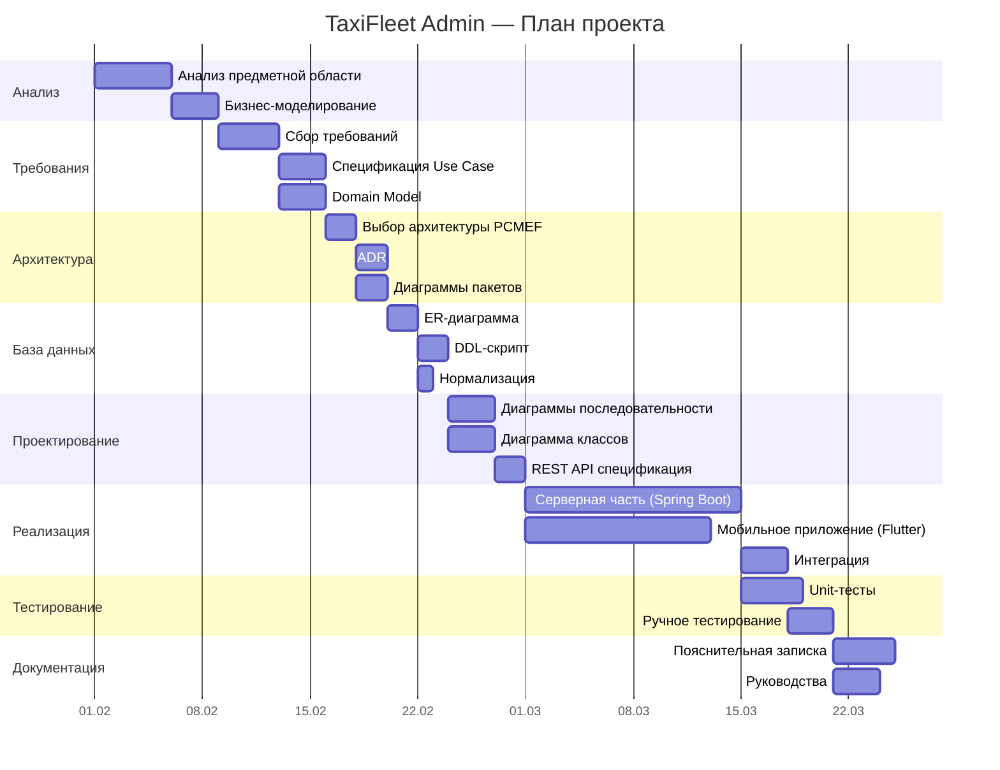
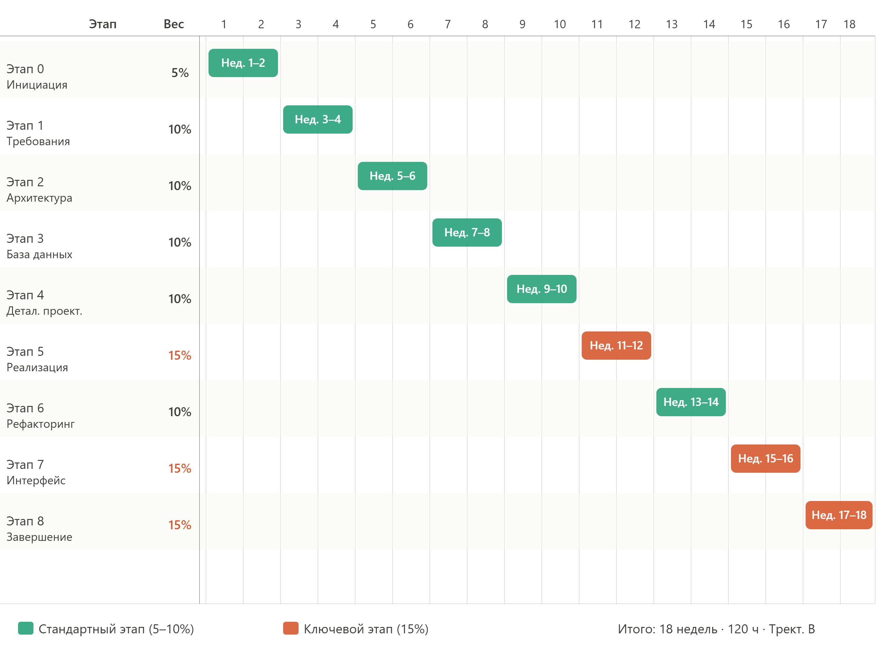

# 08. Итоговые документы

> Заключительные материалы курсового проекта TaxiFleet Admin: WBS, диаграмма Ганта, оценка трудоёмкости, реестр рисков.

---

## 8.1 Документы

| Документ | Ссылка |
|----------|--------|
| Пояснительная записка | [Пояснительная записка](../../README.md) |
| Руководство пользователя | [user-guide.md](user-guide.md) |
| Руководство администратора | [admin-guide.md](admin-guide.md) |
| Техническое задание | [technical-specification.md](technical-specification.md) |

---

## 8.2 WBS (Work Breakdown Structure)

| # | Этап | Трудоёмкость (часы) | Результат |
|---|------|--------------------:|-----------|
| 1 | Анализ предметной области | 8 | Паспорт проекта, IDEF0, BUC, SWOT |
| 2 | Сбор и спецификация требований | 10 | Use Case, Domain Model, спецификации UC |
| 3 | Проектирование архитектуры | 8 | PCMEF, ADR, диаграммы пакетов |
| 4 | Проектирование базы данных | 6 | ER-диаграмма, DDL, нормализация |
| 5 | Детальное проектирование | 10 | Диаграммы последовательности, классов, REST API |
| 6 | Реализация серверной части | 24 | Spring Boot приложение, тесты |
| 7 | Реализация мобильного приложения | 20 | Flutter приложение |
| 8 | Тестирование и отладка | 8 | 17 JUnit-тестов, ручное тестирование |
| 9 | Документирование | 6 | Пояснительная записка, руководства |
| | **Итого** | **100** | |

*Рисунок 8.1 — WBS-диаграмма проекта TaxiFleet Admin*

---

## 8.3 Диаграмма Ганта

*Рисунок 8.2 — Диаграмма Ганта плана проекта*

---

## 8.4 Оценка COCOMO

### Входные параметры

| Параметр | Значение |
|----------|----------|
| Тип проекта | Organic (небольшая команда, знакомая предметная область) |
| KLOC (серверная часть) | ~2.5 |
| KLOC (мобильное приложение) | ~1.8 |
| KLOC (итого) | ~4.3 |

### Расчёт (Basic COCOMO)

| Метрика | Формула | Значение |
|---------|---------|----------|
| Трудоёмкость (PM) | 2.4 × (KLOC)^1.05 | 2.4 × 4.3^1.05 ≈ **11.0 чел.-мес.** |
| Длительность (TDEV) | 2.5 × (PM)^0.38 | 2.5 × 11.0^0.38 ≈ **6.8 мес.** |
| Размер команды (N) | PM / TDEV | 11.0 / 6.8 ≈ **1.6 чел.** |

> **Примечание:** Фактическая трудоёмкость составила ~100 часов (1 разработчик, ~2.5 месяца), что соответствует оценке COCOMO для проекта данного масштаба.

---

## 8.5 Реестр рисков

| ID | Риск | Вероятность | Влияние | Приоритет | Митигация | Статус |
|----|------|-------------|---------|-----------|-----------|--------|
| R-01 | Несовместимость Flutter с целевыми устройствами | Средняя | Высокое | Высокий | Тестирование на нескольких эмуляторах, минимальный SDK API 21 | Закрыт |
| R-02 | Потеря JWT-токена при обновлении приложения | Низкая | Среднее | Средний | SharedPreferences + автоматический redirect на логин при 401 | Закрыт |
| R-03 | Race condition при назначении водителя | Средняя | Высокое | Высокий | @Transactional + проверка статусов в транзакции | Закрыт |
| R-04 | Перегрузка БД при большом числе заказов | Низкая | Высокое | Средний | Индексация полей status и created_at, пагинация | Закрыт |
| R-05 | Утечка JWT-токена | Низкая | Высокое | Высокий | HTTPS, короткий TTL токена, secure storage | Митигирован |
| R-06 | Недоступность сервера | Средняя | Высокое | Высокий | Retry-логика в Dio, информативные сообщения об ошибках | Закрыт |
| R-07 | Срыв сроков разработки | Средняя | Высокое | Высокий | WBS-планирование, ежедневный контроль прогресса | Закрыт |

---

## Навигация

| Предыдущий | Следующий |
|------------|-----------|
| [07. Пользовательский интерфейс](../07-ui/README.md) | [README](../../README.md) |
